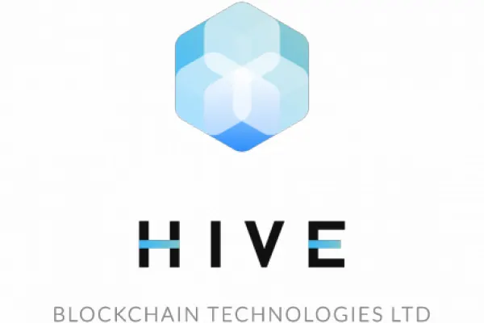

# HIVE A Canadian Crypto Miner

## Overview and Origin

Hive Blockchain Technologies Ltd (Hive), is a cryptocurrency mining firm. Located in Vancouver, BC, got its start back in 1987 as Leeta Gold Corp, when it was incorporated. Leeta combined with Genesis Mining Ltd, a leading crypto miner at the time and changed its name in September 2017, to more closely match its current operations. - [yahoo]

> Genesis Mining, the world's leading hashpower provider with over 700,000 customers, has entered into an exclusive partnership with HIVE to provide and operate up to five blockchain Data Centres - [newswire]

Hive was founded by investors who saw the emerging capabilities of cryptocurrency and the need for high performance computation to get the job done. Initially, Hive was run by interim CEO Harry Pokrandt and select appointees to the board. The company is currently led by Chairman Frank Holmes and CEO Aydin Kilic. [Hive]

Hive has received several amounts of funding from its inception (2017) up to the latest in 2022, totaling $316M. Listed below is their funding in chronological order:

* **$15M** private placement (non-public offering) based on 50M warrants at $0.30/warrant - [hiveblockchain](https://www.hiveblockchain.com/news/hive-blockchain-currently-leeta-gold-announces-strategic-partnership-with-leading-cryptocurrency-miner-genesis-mining-and-acquisition-of-data-centre-in-iceland/)
* **$1.5M** additional to previous placement - [hiveblockchain](https://www.hiveblockchain.com/news/hive-blockchain-currently-leeta-gold-announces-increase-and-full-subscription-of-private-placement/)
* **$30M** bought-deal financing based on 20M shares at $1.50/share - [hiveblockchain](https://www.hiveblockchain.com/news/hive-blockchain-announces-bought-deal-financing-and-acquisition-of-second-data-centre/)
* **$7M** equity investment based on 4,666,667 shares at $1.50/share - [hiveblockchain](https://www.hiveblockchain.com/news/hive-blockchain-announces-7-million-equity-investment-by-genesis-mining/)
* **$30M** bought-deal financing based on 10.7M shares at $2.80/share - [hiveblockchain](https://www.hiveblockchain.com/news/hive-blockchain-announces-30-million-bought-deal-financing-and-launches-second-phase-expansion-in-sweden/)
* **$4.5M** increase to previous bought-deal financing due to underwriters' exercising options in full - [hiveblockchain](https://www.hiveblockchain.com/news/hive-blockchain-closes-345-million-bought-deal-financing-and-expands-production-of-newly-minted-digital-currencies/)
* **$100M** private placement financing - [hiveblockchain](https://www.hiveblockchain.com/news/hive-blockchain-announces-major-expansion-in-sweden-including-new-bitcoin-mining-facility-and-up-to-100-million-financing/)
* **$15M** amendement to previous $100M due to demand and **$3M** from Genesis - [hiveblockchain](https://www.hiveblockchain.com/news/hive-blockchain-announces-upsize-of-financing-to-115-million-including-minimum-investment-of-3-million-by-genesis-mining/)
* **$110M** private placement financing - [hiveblockchain](https://www.hiveblockchain.com/news/hive-blockchain-announces-110020000-bought-deal-private-placement-financing-to-expand-btc-production-by-an-additional-one-exahash-per-second-in-the-summer-2022/)

## Business Activities:

Cryptocurrencies in general, allow for low cost transactions and ease of access to services. Anyone around the world with internet access can participate in cryptocurrency markets. Hive provides a way for investors to gain access to the cryptomarket while not investing directly in cryptocurrency itself.

Hive is committed to bolstering the cryptocurrency market by being a leading player in the mining and blockchain aspects of the industry. Hive wants to continue support for decentralized finance (DeFi) which removes barriers to other participants in the cryptocurrency market.

Hive does sell some of the crypto that it mines but otherwise does not provide a particular product or service to any end customer. Hive's mining activities creates more cryptocurrencies which can then be used in the open market. Market participants are able to invest in the company. Hive has 89 institutional investors. - [fintel.io](https://fintel.io/so/us/hive)

Crypto mining is power intensive and requires high efficiency to improve margins. Hive competes against various smaller crypto mining entities, even individuals but also larger entities like governments. Hive uses 100% renewable energy source for its mining activities to reduce its impact to the environment. They also use a combination of ASIC (application specific integrated circuits) and GPU (graphics processing unit) to mine cryptocurrencies. GPUs can be used to mine any cryptocurrencies whereas ASICs are custom built to support only one cryptocurrency. The ASIC provides better efficiency for the particular cryptocurrency it is mining. Using these ASICs, Hive created a mining machine called, "Hive BuzzMiner", which has greatly improved their ability to mine effectively.

> We are able to operate our machines from 110 TH/s to 130 TH/s (Terahashes per second, 1012), allowing us to optimize the profitability of our fleet, by varying the power consumption and machine efficiency. Accordingly, our initial build of 5,800 HIVE BuzzMiners, can produce between 638 PH/s to 754 PH/s (Petahashes per second, 1015). - [hiveblockchain](https://www.hiveblockchain.com/news/hive-blockchain-announces-commercial-deployment-of-the-hive-buzzminer-powered-by-the-intel-blockscale-asic/)

Hive is utilizing various technologies for its mining activities. The main technology is blockchain which is a large distributed, indestructible ledger of all cryptocurrency transactions. Hive has invested a lot in hardware for their data centers as well as the chips that power that hardware. Hive is one of four companies that has been selected to use Intel's "Blockscale" chip. As previously mentioned, they have developed their own highly efficient crypto mining machine. - [hiveblockchain](https://www.hiveblockchain.com/news/hive-blockchain-provides-march-2022-production-and-intel-update/) 

## Landscape:

Hive operates in the cryptocurrency mining industry which has seen some major developments over the last 5-10 years. One of the greatest innovations during those years has been in the semiconductor industry. GPUs and ASICs that perform vast amounts of calculations at high speed and efficiency have changed the game for crypto mining. Without these innovations, crypto mining would not be feasible. The mining process requires a lot of energy to drive the machines and chips that do the actual mining. Green energy technology has helped miners run their business sustainably and not draw the attention of regulators. The industry has attracted a lot of attention all over the world and there are more players in it today. Notably, Hive's main competitors are Riot Blockchain, and Hut 8 Mining Corp. - [Investopedia](https://www.investopedia.com/top-crypto-mining-stocks-5213809)

## Results

Hive has operations around the world including Iceland, Sweden and its headquarters in Canada. They've utilized state of the art technology to mine crypto using renewable energy sources. They've shown that crypto mining can be done in an environmentally friendly way and can provide value to investors without having to directly take on the risk of crypto.

One of the best metrics for crypto mining is hashes per second (H/s). When crypto is created, it has to be written to the blockchain through solving complicated mathematical problems to verify hashes. So the amount of crypto mined is directly associated with how many hashes are created in a given time. Additionally, the energy consumption in megawatts (MW) will add to their costs and should be reduced.

|Company|Hash Rate (EH/s)|Energy Consumption (MW)|
|-------|:--------------:|:---------------------:|
|Hive   |2.68|128|
|Riot   |4.6|136|
|Hut 8  |2.5|109|

\* EH/s: Exahashes per second, Exa=1018 

Hive and Riot crypto production is summarized in the table below:

|Company|BTC Holdings 2022|
|:------|:---------------:|
|Hive|3342|
|Riot|6897|

[hiveblockchain](https://www.hiveblockchain.com/investors/presentation), [riot](https://www.riotplatforms.com/news-media/press-releases/detail/145/riot-announces-december-2022-production-and-operations)

It would appear that Riot is very much ahead of Hive in the amount of BTC it has produced. Hive will remain a fierce competitor in the crypto mining field as they continue to grow their data centers and invest in more efficient machines. Hive also has operations around the world which keeps it well diversified.

## Recommendations

Hive has invested a lot of its resources into building crypto mining facilities that use state of the art machines and green energy. As regulators around the world are increasingly concerned with sustainability, Hive can lease some of their resources to other companies or individuals. Hive could levy a fee for this service that would compensate them for all their costs plus some profit margin. This would be a cloud-based approach. Their strategy of mining and hoarding or selling cryptocurrencies is great as long as the value of the cryptocurrency remains strong. By allowing other participants to mine and accumulate cryptocurrencies, they may encourage the use and demand for it, thus increasing its value. To enable this, Hive would only have to make sure that their machines are only leased out for the duration of the contract and make sure that they are always functional. However, opening their networks to outsiders would require stronger cybersecurity since there may be some malicious users who may compromise their systems.

Hive could also lease out its data centers for other industries that require high power computation such as AI/ML and cybersecurity. Some other companies have started doing this as a way to diversify their revenue streams.

> Miners entering the high-performance computing market are essentially hitching the wagon on a “mega-trend that should last for many years,” B. Riley’s Pipe said. - [coindesk](https://www.coindesk.com/consensus-magazine/2023/02/21/bitcoincrypto-miners-diversifying-amid-icy-winter/)

Selling power credits could also boost revenue if some data centers were to be shut down temporarily. Power can be sold back to the grid. This depends on the jurisdiction of the data center.

Hive stores all of its cryptocurrency in cold storage meaning that it is not connected to the internet. This keeps it safe from hackers or any other compromise from the network. They could offer to store crypto for customers like a bank safe deposit box for a fee. Offering cold storage for crypto for a fee, could add another revenue stream but it does create issues with physical security of the cold wallets.

[yahoo]: <https://ca.finance.yahoo.com/quote/HIVE.V/profile?p=HIVE.V>
[newswire]: <https://www.newswire.ca/news-releases/hive-blockchain-currently-leeta-gold-announces-strategic-partnership-with-leading-cryptocurrency-miner-genesis-mining-and-acquisition-of-data-centre-in-iceland-628387573.html>
[tgam]: <https://www.theglobeandmail.com/globe-investor/investment-ideas/frank-giustra-backed-firm-hive-switches-from-mining-gold-to-bitcoin/article36572363/>
[Hive]: <https://www.hiveblockchain.com/corporate/about>
[Hive_fin2]: <https://www.hiveblockchain.com/news/hive-blockchain-announces-major-expansion-in-sweden-including-new-bitcoin-mining-facility-and-up-to-100-million-financing/>
